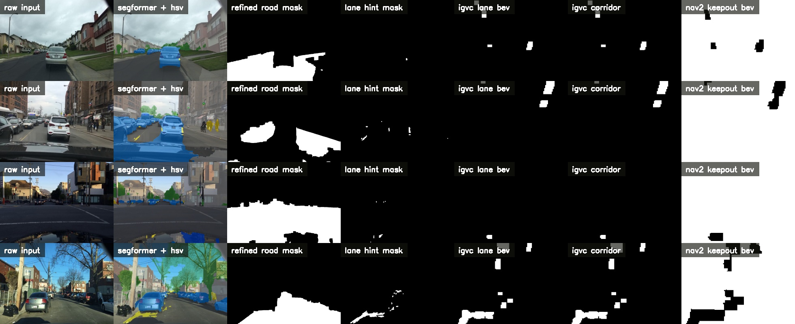

# Competiton Semantic Segmentation: Nav2 SegFormer Branch

This branch turns the SegFormer experiment into a **ROS 2 Jazzy + RViz + Nav2-compatible local perception demo** for IGVC-style imagery.

It does five things that `main` does not:

1. runs **SegFormer + HSV refinement** as a separate semantic backend
2. extracts **IGVC-style white lane boundaries** in BEV
3. publishes a **local Nav2 keepout mask** as `nav_msgs/msg/OccupancyGrid`
4. stabilizes lane and drivable outputs over time
5. provides a **repeatable RViz demo** using your image set in `/home/alexander/Desktop/img`

This branch stays separate because it is still an experiment. It is meant to answer one question:

```text
Can SegFormer produce a usable local drivable / keepout representation for Nav2 on IGVC-style camera imagery?
```

## Current Status

What is working in this branch:

- ROS 2 image subscriber for SegFormer
- optional HSV refinement for road fill and lane-paint hinting
- IGVC-specific white-line extraction and lane corridor generation
- temporal smoothing for lane corridor and drivable grid outputs
- lane confidence and planner mode hint topics
- RViz config showing input, overlay, masks, and Nav2 grids
- replay node for `/home/alexander/Desktop/img`
- local Nav2 outputs:
  - `/seg_ros/segformer/nav2/filter_mask`
  - `/seg_ros/segformer/nav2/drivable_grid`
  - `/seg_ros/segformer/nav2/costmap_filter_info`
- metric BEV ranges and front-camera mount priors for a ZED X forward view

What is intentionally not claimed:

- this is **not** a full IGVC winner stack
- this is **not** a complete replacement for object detection, stop signs, pedestrians, or potholes
- the Nav2 mask is a **local projected keepout grid**, not a full global planner map

## IGVC Relevance

From the official 2026 IGVC rules, the project needs to handle:

- white lane boundaries on asphalt
- obstacles and barrels
- potholes
- pedestrians
- stop signs
- lane keeping and lane changes
- planner-safe outputs

SegFormer alone does not solve all of that. This branch focuses on the part it can honestly help with:

```text
camera image
-> semantic road understanding
-> road refinement + lane-paint hints
-> IGVC white-line extraction in BEV
-> lane corridor estimate
-> local keepout/drivable grid
-> Nav2-compatible messages
```

Sources:

- http://www.igvc.org/
- http://www.igvc.org/2026rules.pdf
- http://www.igvc.org/reports.htm

## Runtime Architecture

```text
image_replay_node or ZED X topic
        |
        v
segformer_node
  nvidia/segformer-b0-finetuned-cityscapes-512-1024
        |
        +--> /seg_ros/segformer/overlay_image
        +--> /seg_ros/segformer/road_mask_raw
        +--> /seg_ros/segformer/road_mask
        +--> /seg_ros/segformer/sidewalk_mask
        +--> /seg_ros/segformer/lane_hint_mask
        +--> /seg_ros/segformer/igvc_white_mask
        +--> /seg_ros/segformer/igvc_lane_bev
        +--> /seg_ros/segformer/igvc_lane_corridor_mask
        +--> /seg_ros/segformer/lane_detected
        +--> /seg_ros/segformer/planner_mode_hint
        +--> /seg_ros/segformer/nav2/filter_mask
        +--> /seg_ros/segformer/nav2/drivable_grid
        +--> /seg_ros/segformer/nav2/costmap_filter_info
```

## Proof From `/home/alexander/Desktop/img`

The contact sheet below was generated directly from your image folder:

```text
raw input | segformer + hsv | refined road mask | lane hint mask | igvc lane bev | igvc corridor | nav2 keepout bev
```



Generated summary:

- [summary json](proof/segformer_nav2_igvc/segformer_nav2_summary.json)

## ROS Topics

| Topic | Type | Purpose |
|---|---|---|
| `/seg_ros/segformer/input_image` | `sensor_msgs/msg/Image` | republished source image |
| `/seg_ros/segformer/overlay_image` | `sensor_msgs/msg/Image` | semantic overlay |
| `/seg_ros/segformer/class_mask` | `sensor_msgs/msg/Image` | raw class-id mask |
| `/seg_ros/segformer/road_mask_raw` | `sensor_msgs/msg/Image` | direct Cityscapes road class |
| `/seg_ros/segformer/road_mask` | `sensor_msgs/msg/Image` | HSV-refined road mask |
| `/seg_ros/segformer/sidewalk_mask` | `sensor_msgs/msg/Image` | sidewalk class |
| `/seg_ros/segformer/lane_hint_mask` | `sensor_msgs/msg/Image` | white/yellow paint cue mask |
| `/seg_ros/segformer/igvc_white_mask` | `sensor_msgs/msg/Image` | white-line candidate mask in image space |
| `/seg_ros/segformer/igvc_lane_bev` | `sensor_msgs/msg/Image` | bird's-eye lane boundary mask |
| `/seg_ros/segformer/igvc_lane_corridor_mask` | `sensor_msgs/msg/Image` | fused lane corridor in BEV |
| `/seg_ros/segformer/lane_detected` | `std_msgs/msg/Bool` | lane corridor strong enough to trust |
| `/seg_ros/segformer/planner_mode_hint` | `std_msgs/msg/String` | `lane_following` or `obstacle_avoidance` |
| `/seg_ros/segformer/nav2/bev_keepout_mask` | `sensor_msgs/msg/Image` | projected top-down debug image |
| `/seg_ros/segformer/nav2/filter_mask` | `nav_msgs/msg/OccupancyGrid` | Nav2 keepout filter mask |
| `/seg_ros/segformer/nav2/drivable_grid` | `nav_msgs/msg/OccupancyGrid` | local drivable-vs-nondrivable grid |
| `/seg_ros/segformer/nav2/costmap_filter_info` | `nav2_msgs/msg/CostmapFilterInfo` | Nav2 filter metadata |
| `/seg_ros/segformer/metadata` | `std_msgs/msg/String` | pixel counts and grid info |
| `/seg_ros/segformer/timing` | `std_msgs/msg/String` | runtime timing |

## Build

```bash
cd /home/alexander/Desktop/Competiton_Semantic_Segmentation/ros2_ws
source /opt/ros/jazzy/setup.bash
colcon build --packages-select seg_ros_bridge
source install/setup.bash
```

Install optional SegFormer dependency:

```bash
/home/alexander/github/av-perception/.venv/bin/python -m pip install -r requirements-segformer.txt
```

## Demo With Your Images

This is the fastest way to see the branch working in RViz:

```bash
source /opt/ros/jazzy/setup.bash
source /home/alexander/Desktop/Competiton_Semantic_Segmentation/ros2_ws/install/setup.bash

ros2 launch seg_ros_bridge segformer_demo.launch.py \
  image_dir:=/home/alexander/Desktop/img \
  fps:=1.0 \
  use_rviz:=true
```

That launch does all of this:

- publishes your images as a ROS image stream
- runs SegFormer
- opens RViz with the branch config

## Live ZED X Run

```bash
source /opt/ros/jazzy/setup.bash
source /home/alexander/Desktop/Competiton_Semantic_Segmentation/ros2_ws/install/setup.bash

ros2 launch seg_ros_bridge segformer.launch.py \
  image_topic:=/zed/zed_node/rgb/color/rect/image \
  device:=cpu \
  enable_hsv_refinement:=true \
  nav2_publish_grid:=true \
  use_rviz:=true
```

## Nav2 Integration

This branch publishes the exact message pair expected by Nav2 costmap filters:

- `nav_msgs/msg/OccupancyGrid`
- `nav2_msgs/msg/CostmapFilterInfo`

Example local costmap config:

- [config/nav2_keepout_example.yaml](config/nav2_keepout_example.yaml)

Important boundary:

- the branch currently publishes a **local keepout grid in `base_link`**
- this is best suited for **local costmap filtering**
- a full global Nav2 map pipeline is not included here
- camera mount values are treated as a **practical prior**, not a final measured calibration

## Generate Proof Again

```bash
/home/alexander/github/av-perception/.venv/bin/python \
  scripts/generate_nav2_segformer_proof.py \
  --input-dir /home/alexander/Desktop/img \
  --output-dir proof/segformer_nav2_igvc \
  --device cpu \
  --limit 6
```

## Current Opinion

This branch is a better **Nav2-facing semantic demo** than the older SegFormer branch state because it now produces:

- RViz-visible masks
- repeatable replay from your images
- IGVC-specific lane boundaries and corridor extraction
- planner-facing local occupancy outputs

It is still weaker than a full competition stack because it does not yet cover:

- stop-sign handling
- pedestrian stop behavior
- pothole-specific logic
- object detection fusion

## Related Files

- [segformer node](ros2_ws/src/seg_ros_bridge/seg_ros_bridge/segformer_node.py)
- [image replay node](ros2_ws/src/seg_ros_bridge/seg_ros_bridge/image_replay_node.py)
- [SegFormer launch](ros2_ws/src/seg_ros_bridge/launch/segformer.launch.py)
- [demo launch](ros2_ws/src/seg_ros_bridge/launch/segformer_demo.launch.py)
- [RViz config](ros2_ws/src/seg_ros_bridge/rviz/segformer.rviz)
- [proof generator](scripts/generate_nav2_segformer_proof.py)
