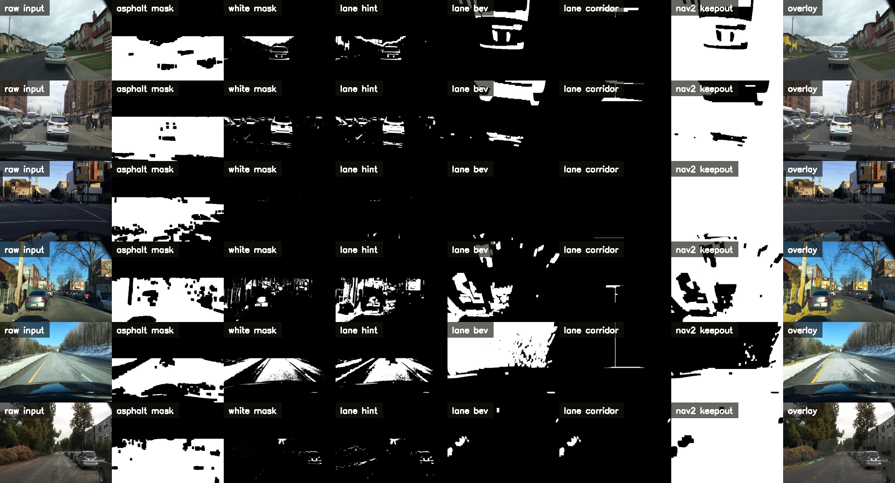

# IGVC Nav2 BEV Perception

Website:

- https://arassal.github.io/IGVC_Nav2_SegFormer/

ROS 2 Jazzy perception package for **IGVC-style lane boundaries** with a **BEV-first pipeline** and **Nav2-compatible keepout / drivable grids**.

This repo is built around the architecture I would actually choose for IGVC:

```text
camera image
-> asphalt / line extraction
-> bird's-eye-view lane boundaries
-> lane corridor estimate
-> local drivable grid
-> local keepout grid
-> Nav2 costmap filter messages
```

It is intentionally narrow. The main path is **lane boundaries and local navigation support**. Object detection can be layered on separately, but it is not the core of this repo.

## Dashboard

A static reference dashboard for the live camera layout and current stream assumptions lives at:

- Public site: https://arassal.github.io/IGVC_Nav2_SegFormer/
- Source file: [docs/index.html](/home/alexander/Desktop/IGVC_Nav2_SegFormer/docs/index.html)

It is designed to be GitHub Pages-compatible and to keep the final layout stable:

- `left` reserved
- `front` primary live feed
- `right` reserved
- `back` intentionally omitted

The dashboard also keeps the stream base URL configurable so it can point at the Jetson over Tailscale when available.

## What This Repo Does

- extracts likely asphalt support from the lower image
- extracts white and yellow lane paint candidates
- projects those cues into bird's-eye view
- selects left and right lane boundary components
- builds a lane corridor
- publishes:
  - debug images for RViz
  - `nav_msgs/msg/OccupancyGrid`
  - `nav2_msgs/msg/CostmapFilterInfo`
  - lane state and planner mode hints

## Why This Architecture

For IGVC, the hard part is usually not generic semantic segmentation. It is:

- stable white boundary handling
- planner-safe top-down outputs
- simple failure behavior when lane evidence is weak

That is why this repo is BEV-first and Nav2-first.

## ROS 2 Interface

Primary node:

- `igvc_bev_node`

Main topics:

| Topic | Type | Purpose |
|---|---|---|
| `/igvc_bev/input_image` | `sensor_msgs/msg/Image` | republished source image |
| `/igvc_bev/overlay_image` | `sensor_msgs/msg/Image` | lane and corridor overlay |
| `/igvc_bev/asphalt_mask` | `sensor_msgs/msg/Image` | asphalt support mask |
| `/igvc_bev/white_mask` | `sensor_msgs/msg/Image` | white-line candidate mask |
| `/igvc_bev/yellow_mask` | `sensor_msgs/msg/Image` | yellow-line candidate mask |
| `/igvc_bev/lane_hint_mask` | `sensor_msgs/msg/Image` | combined paint cue mask |
| `/igvc_bev/lane_bev` | `sensor_msgs/msg/Image` | bird's-eye lane evidence |
| `/igvc_bev/lane_corridor_mask` | `sensor_msgs/msg/Image` | fused lane corridor in BEV |
| `/igvc_bev/road_bev` | `sensor_msgs/msg/Image` | BEV drivable prior |
| `/igvc_bev/lane_detected` | `std_msgs/msg/Bool` | lane corridor strong enough to trust |
| `/igvc_bev/planner_mode_hint` | `std_msgs/msg/String` | `lane_following` or `obstacle_avoidance` |
| `/igvc_bev/nav2/bev_keepout_mask` | `sensor_msgs/msg/Image` | top-down keepout debug image |
| `/igvc_bev/nav2/filter_mask` | `nav_msgs/msg/OccupancyGrid` | Nav2 keepout filter mask |
| `/igvc_bev/nav2/drivable_grid` | `nav_msgs/msg/OccupancyGrid` | local drivable-vs-nondrivable grid |
| `/igvc_bev/nav2/costmap_filter_info` | `nav2_msgs/msg/CostmapFilterInfo` | Nav2 keepout metadata |
| `/igvc_bev/metadata` | `std_msgs/msg/String` | runtime and pixel/cell counts |
| `/igvc_bev/timing` | `std_msgs/msg/String` | per-frame timing |

## Nav2 Compatibility

This repo publishes the **exact message types Nav2 keepout filters expect**:

- `nav_msgs/msg/OccupancyGrid`
- `nav2_msgs/msg/CostmapFilterInfo`

The `CostmapFilterInfo.type` is published as `0`, which is the keepout / preferred-lane filter type in Nav2 docs.

Relevant references:

- https://api.nav2.org/msgs/jazzy/costmapfilterinfo.html
- https://docs.nav2.org/configuration/packages/costmap-plugins/keepout_filter.html
- https://docs.nav2.org/tutorials/docs/navigation2_with_keepout_filter.html

Example local costmap config:

- [nav2_keepout_example.yaml](/home/alexander/Desktop/IGVC_Nav2_SegFormer/config/nav2_keepout_example.yaml)

## Proof Images

Generated from `/home/alexander/Desktop/img`:

```text
raw input | asphalt mask | white mask | lane hint | lane bev | lane corridor | nav2 keepout | overlay
```



Per-run summary:

- [igvc_bev_summary.json](/home/alexander/Desktop/IGVC_Nav2_SegFormer/proof/igvc_bev/igvc_bev_summary.json)

## Build

```bash
cd /home/alexander/Desktop/IGVC_Nav2_SegFormer/ros2_ws
source /opt/ros/jazzy/setup.bash
colcon build --packages-select seg_ros_bridge
source install/setup.bash
```

## Demo With Recorded Images

```bash
cd /home/alexander/Desktop/IGVC_Nav2_SegFormer/ros2_ws
source /opt/ros/jazzy/setup.bash
source install/setup.bash

ros2 launch seg_ros_bridge igvc_bev_demo.launch.py \
  image_dir:=/home/alexander/Desktop/img \
  fps:=1.0 \
  use_rviz:=true
```

This launch does three things:

- replays images as a ROS topic
- runs `igvc_bev_node`
- opens RViz with the BEV lane displays and Nav2 grids

## Live Camera Run

```bash
cd /home/alexander/Desktop/IGVC_Nav2_SegFormer/ros2_ws
source /opt/ros/jazzy/setup.bash
source install/setup.bash

ros2 launch seg_ros_bridge igvc_bev.launch.py \
  image_topic:=/zed/zed_node/rgb/color/rect/image \
  use_rviz:=true
```

## Generate Proof Again

```bash
cd /home/alexander/Desktop/IGVC_Nav2_SegFormer
python3 scripts/generate_igvc_bev_proof.py \
  --input-dir /home/alexander/Desktop/img \
  --output-dir proof/igvc_bev \
  --limit 6
```

## Current Boundaries

What is interface-proven in this repo:

- ROS 2 nodes and launches build
- Nav2 keepout message types are correct
- local keepout and drivable grids publish in `base_link`
- replay workflow works from an image folder

What still requires vehicle validation:

- final BEV trapezoid tuning for the mounted ZED X camera
- lane reliability under glare, shadows, worn paint, and turns
- actual Nav2 behavior on the robot

This is the cleanest version of the system I would start from for IGVC: **lane-first, BEV-first, and local-planner-facing**.
